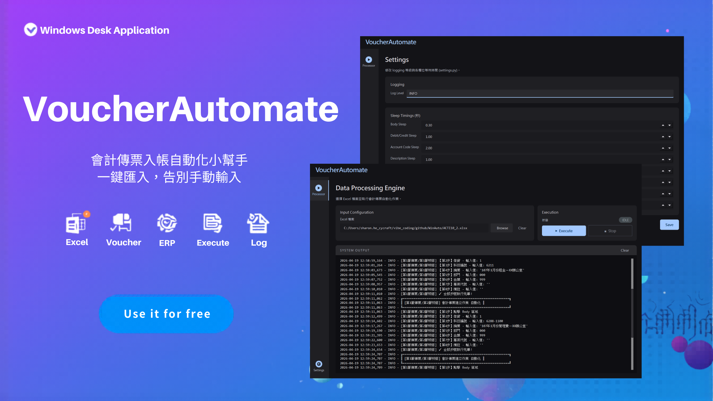

# VoucherAutomate 會計傳票自動化工具

## 📋 簡介

VoucherAutomate 是一個為鼎新會計系統設計的自動化工具，可幫助您快速輸入大量會計傳票。只需準備好 Excel 檔案，程式會自動完成傳票的逐筆輸入工作，節省大量時間和降低人工錯誤。




**主要優勢：**
- ⚡ **高速批量輸入**：幾秒內完成手工需花費數分鐘的工作
- 📊 **Excel 批量導入**：支援 .xlsx 格式，結構清晰易用
- 🎨 **直觀 GUI 界面**：無需命令列操作，一鍵啟動
- 🔍 **實時日誌監控**：清晰展示每筆傳票的輸入進度
- ⚙️ **靈活配置系統**：可調整輸入延遲、修改應用程式標題等

## 🚀 快速開始

- [下載VoucherAutomate.exe](https://github.com/sharonhe-byte/VoucherAutomate/releases)
- 選擇最新版本下載(VoucherAutomate.zip)
- 解壓縮執行.exe即可使用


## ⚡開發

### 前置需求

- **Windows 10/11**（64 位元）
- **Python 3.8+**
- **鼎新會計傳票系統**：已安裝並能正常執行
- **Excel 檔案**：符合規定格式

### 安裝步驟

1. **複製或下載本專案**
   ```bash
   git clone <repository-url>
   cd WinAuto
   ```

2. **安裝依賴套件**
   ```bash
   pip install -r requirements.txt
   ```

3. **驗證安裝**
   ```bash
   python -c "from pywinauto import Application; print('✓ 安裝成功')"
   ```

### 使用 GUI（推薦新手）

1. **啟動應用程式**
   ```bash
   python gui.py
   ```

2. **在 GUI 中：**
   - 點擊 "Browse" 選擇您的 Excel 檔案
   - 點擊 "Execute" 開始自動化
   - 在下方終端窗格實時監控進度

3. **自定義設定（可選）**
   - 切換到 "Settings" 分頁修改：
     - Log Level（日誌級別）
     - 各欄位的輸入延遲時間

### 使用命令列（進階用戶）

```bash
# 預設讀取 src/ACTI10_2.xlsx
python src/main.py

# 指定 Excel 檔案路徑
python src/main.py --excel-path /path/to/your/file.xlsx
```

## 📄 Excel 檔案格式

您的 Excel 檔案必須包含以下欄位（工作表名稱為「單身資料」）：


| 欄位名稱 | 說明 | 範例 |
|---------|------|------|
| **傳票日期** | 傳票日期 | 2024-01-15 |
| **傳票單別** | 傳票類別代碼 | 01 |
| **借/貸** | 借貸標記：1=借方，-1=貸方 | 1 |
| **科目編號** | 會計科目代碼 | 6211 |
| **摘要** | 交易摘要說明 | 辦公用品費 |
| **部門** | 部門代碼 | 100 |
| **金額** | 交易金額 | 1000 |
| **專案代號** | 專案代碼（可選） | 2024-001 |
| **備註** | 傳票備註（可選） | 採購文具 |
| **備註_2** | 明細備註（可選） | 筆記本 |

**結構說明：**
- 每張傳票在「傳票日期」列開始新記錄
- 同一張傳票的多筆明細在同一傳票日期下方依序輸入
- 若某行「傳票日期」為空，則視為同一傳票的下一筆明細

**範例資料結構：**

| 傳票日期 | 傳票單別 | 借/貸 | 科目編號 | 摘要 | 金額 | 備註 |
|---------|---------|------|---------|------|------|------|
| 2024-01-15 | 01 | 1 | 6211 | 辦公用品 | 1000 | 採購 |
|  |  | -1 | 2100 | 應付帳款 | 1000 |  |
| 2024-01-16 | 01 | 1 | 1100 | 現金 | 500 | 日常支出 |
|  |  | -1 | 5000 | 雜支 | 500 |  |

## ⚙️ 常見設定調整

### 場景 1：輸入變得不穩定或卡住

**原因**：目標應用程式回應較慢

**解決方法**：
1. 打開 GUI → Settings 分頁
2. 增加相關欄位的延遲時間（如 Account Code Sleep、Amount Sleep）
3. 建議增加 0.5 秒開始試驗

### 場景 2：應用程式視窗標題變更

**原因**：系統版本更新或應用程式重新安裝

**解決方法**：
1. 編輯 `settings.py`
2. 修改 `APP_TITLE_RE` 為新的視窗標題正則表達式
3. 範例：`APP_TITLE_RE = "會計傳票建立作業.*V3.0"`

### 場景 3：日誌輸出過多或過少

**原因**：日誌級別設定不適合當前場景

**解決方法**：
- **測試/除錯時**：在 GUI 設定改為 DEBUG（顯示詳細資訊）
- **生產環境**：改為 INFO（只顯示重要訊息）

## ❓ 常見問題 (FAQ)

### Q: 執行時出現「ModuleNotFoundError: No module named 'pywinauto'」

**A**: 尚未安裝依賴套件。執行：
```bash
pip install -r requirements.txt
```

### Q: 執行時應用程式視窗找不到

**A**: 
1. 確認鼎新會計系統已執行且視窗在前台
2. 驗證 `settings.py` 中的 `APP_TITLE_RE` 與實際視窗標題相符
3. 嘗試手動啟動目標應用程式的「傳票建立作業」視窗

### Q: 傳票輸入中途卡住不動

**A**:
1. 檢查是否出現系統提示框或對話框（需手動關閉）
2. 增加相關欄位的延遲時間（Settings 分頁）
3. 檢查 Excel 檔案中是否有空值或格式錯誤的資料

### Q: 如何只輸入部分傳票而不是全部？

**A**: 
1. 將不需輸入的傳票行從 Excel 刪除或隱藏
2. 執行程式時只會讀取可見的資料行

### Q: 支援 .xls 格式的 Excel 檔案嗎？

**A**: 目前只支援 .xlsx 格式。若您的檔案是 .xls，請用 Excel 另存新檔為 .xlsx。

### Q: 可否批量執行多個 Excel 檔案？

**A**: 目前需個別執行。建議將多個檔案合併為一個，或在指令列迴圈執行：
```bash
for /r "C:\data" %%f in (*.xlsx) do python src/main.py --excel-path "%%f"
```

### Q: 輸入速度可以更快嗎？

**A**: 可以，但需謹慎：
1. 減少 `settings.py` 中的延遲時間（不建議低於 0.3 秒）
2. 關閉其他耗資源的程式
3. 確保目標應用程式在高效能模式執行

## 🐛 故障排除

### 症狀：傳票輸入到一半停止

**檢查清單：**
- [ ] 鼎新系統是否出現錯誤對話框？
- [ ] Excel 檔案中該行資料是否有空值？
- [ ] 該欄位的延遲時間是否足夠？
- [ ] 網路連接是否正常（若為遠端系統）？

**解決步驟：**
1. 檢查 GUI 終端窗格中的錯誤訊息
2. 將日誌級別改為 DEBUG 重新執行，查看詳細日誌
3. 確認 Excel 資料格式正確（日期格式、數字格式等）

### 症狀：GUI 啟動後黑屏或卡住

**原因**：模組載入失敗

**解決方法：**
1. 在命令列執行 `python gui.py 2>&1` 查看錯誤訊息
2. 確認所有依賴套件已安裝：`pip install -r requirements.txt`
3. 嘗試刪除 `__pycache__` 資料夾並重新執行


## 打包成.exe

1. 安裝 PyInstaller
```
pip install pyinstaller
```                                                                                                                
2. 執行打包
```                                                                                                                       
pyinstaller VoucherAutomate.spec
```

3. 打包完成後，dist/VoucherAutomate/ 目錄就是可分發的版本：
```
dist/VoucherAutomate/
├── VoucherAutomate.exe   ← 主執行檔
└── _internal/
   ├── settings.py       ← 可讀寫的設定檔
   ├── src/              ← 動態載入的模組
   │   ├── main.py
   │   ├── body.py
   │   └── ...
   └── PySide6/ 等依賴
```

4. 重要提醒：
- 分發時需整個 dist/VoucherAutomate/ 目錄，不能只給 .exe
- settings.py 在 _internal/ 內，GUI Settings 頁面的修改會正常存檔
- 若需要 .ico 圖示，可將 icon='path/to/icon.ico' 加入 EXE(...) 中


## 📞 技術支援

若遇到問題，請提供以下資訊：
1. **錯誤訊息**：GUI 終端窗格或命令列輸出
2. **Excel 檔案結構**：前幾列的資料範例
3. **系統環境**：Windows 版本、Python 版本、鼎新系統版本

## 📝 變更日誌

### v1.0.0 (2024-01-15)
- ✅ 基礎功能發佈
- ✅ GUI 界面上線
- ✅ 支援 Excel 批量導入
- ✅ 實時日誌監控
- ✅ 動態配置系統

## 📄 授權

本專案為內部使用工具。

## 🤝 貢獻

本專案為私有項目。若有改進建議，請聯絡開發團隊。

---

**最後更新**：2024-04-19  
**維護者**：Sharon He
