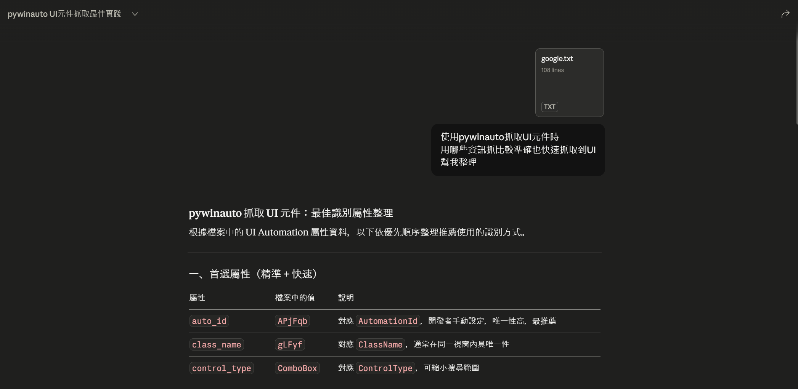
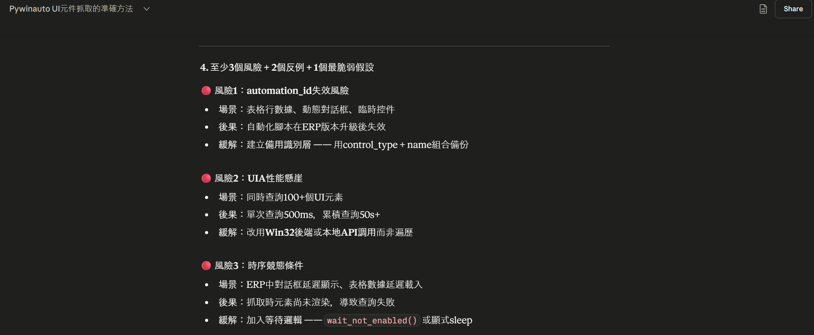

# INTRO

```
# 分享claude處理例行公事，使用前如何手動，耗時?
# 如何用提示詞
# 幾次finetune的過程
# 最後產出結果如何
# 下次要做什麼流程改善
```


```
大綱

1. 分享使用的工具

2. VoucherAutomate
  - Step 1 : 技術評估
  - Step 2 : 統一欄位中英文
  - Step 3 : 建立CLAUDE.md
  - Step 4 : 抓取視窗，讓視窗在焦點上
  - Step 5 : 使用pywinauto套件(單頭 head.py)
  - Step 6 : 使用pywinauto套件(單身 body.py)
  - Step 7 : 讀取Excel
  - Step 8 : Bug Fixing與效能調整
  - Step 9 : Python的UI套件選擇
  - Step 10 : UI的設計
  - Step 11 : settings.py 設定檔
  - Step 12 : UI程式碼撰寫
  - Step 13 : UI程式碼撰寫
  - Step 14 : 更新文檔
  - 補充
  - 效益

3. 生成圖片與PTT

4. 復盤 & 下次想做的

```

# 分享使用的工具

- IDE程式編輯器 : VSCode 
- 程式碼版本控制平台 :Github
- Claude Code CLI / Claude VSCode Extension

- UI設計 : Google Stitch
- 生產圖片 : Claude + Canva
- PPT : Claude Design


# VoucherAutomate


## Step 1 : 技術評估
- 若使用座標定位，則需要考慮到不同設備的解析度和屏幕尺寸，可能會導致元素位置不一致，而自動化失敗，且無法共享給同事使用。
- 技術評估提示詞
```
我想用python操控電腦與鍵盤
操作鼎新的Smart ERP的會計系統(Windwos桌面應用程式)
如果我不想靠點擊座標的方式
還有什麼方法可以讓我去點擊以及輸入文字嗎？
```
- 從最穩到不穩


| 策略等級 | 優點 | 缺點 / 限制 |
|----------|------|------------|
| **Level 1：API / DB（最穩定）** | 1. 效能最好：處理速度最快<br>2. 高度穩定：不受 UI 介面改版影響<br>3. 資料準確：直接對接後端 | 1. 開放性低：鼎新原廠通常不輕易開放權限<br>2. 技術門檻高：需熟悉資料庫結構與 API 通訊 |
| **Level 2：UI Automation（推薦方案）** | 1. 準確度高：透過「控制項 ID」定位，非座標<br>2. 容錯率高：視窗位移或解析度改變仍可運作 | 1. 依賴控制項：前提是 Inspect.exe 必須能抓取到元件<br>2. 環境依賴：ERP 版本若大幅改版（控制項更名）需更新 |
| **Level 3：座標 + OCR（最後手段）** | 1. 通用性最強：只要螢幕看得到的都能操作<br>2. 無視架構：不論 ERP 內部如何封裝皆可強行操作 | 1. 非常脆弱：解析度、縮放比例、視窗遮擋都會導致失敗<br>2. 維護成本極高：UI 稍微變動就得重新寫座標<br>3. 速度最慢：需等待畫面渲染與辨識 |


- 結論 : 選擇使用Level 2：UI Automation，並且AI推薦可以用Python的pywinauto套件來實現操作滑鼠與鍵盤


## Step 2 : 統一欄位中英文
- 有助於Excel欄位名稱，轉換成程式碼使用的英文，也有助於提示詞的撰寫，讓AI更容易理解你的需求

- 欄位名稱對應如下：

| 原中文 | 英文 |
|--------|------|
| 傳票單別 | voucher_type |
| 傳票日期 | voucher_date |
| 備註 | voucher_remark |
| 明細 | lines |
| 借/貸 | debit_credit |
| 科目編號 | account_code |
| 摘要 | description |
| 部門 | dept_code |
| 金額 | amount |
| 專案代號 | project_code |
| 備註_明細 | line_note |


## Step 3 : 建立CLAUDE.md
- 在專案中建立CLAUDE.md，CLAUDE.md是這個專案的工作準則，以後你做什麼任務他都會先讀這個CLAUDE.md，然後才會開始做任務。
- CLAUDE.md的內容可以包含一些專案的背景、目標、以及一些重要的注意事項。以後實作過程中，發現有什麼重要的必做or不可做的事情，就可以直接更新CLAUDE.md，讓AI在執行任務前先讀取這些注意事項，避免他犯同樣的錯誤。
```
/init 我想用python的pywinauto套件來操控電腦與鍵盤
我想讀取Excel傳票資料
操作電腦與鍵盤將傳票資料輸入到鼎新的Smart ERP的會計系統(Windwos桌面應用程式)
並且不能用座標的方式去點擊螢幕上的按鈕或是輸入文字
```


## Step 4 : 抓取視窗，讓視窗在焦點上
- 這步驟是要讓程式先抓到視窗，並且讓這個視窗在焦點上，才不會出現程式在操作鍵盤的時候，卻去操作到其他視窗的狀況
- 一種是截圖整個視窗然後執行下面的提示詞，如果沒抓到視窗，另一種是直接使用inspect.exe去抓取視窗資訊貼給AI，然後執行下面的提示詞
```
幫我使用pywinauto套件
去抓取會計傳票建立作業的視窗
讓這個視窗在焦點上
```


## Step 5 : 使用pywinauto套件(單頭 head.py)


- 單頭的提示詞
```
幫我寫一個head.py
讓使用者可以傳入三個參數 : 傳票單別(voucher_type)、傳票日期(voucher_date)、傳票摘要(voucher_remark)
並使用pywinauto套件操作ERP畫面
以下是我的操作動作:
1. 幫我鍵盤輸入F5(新增動作)
2. 鍵盤輸入傳票單別(變數名稱 voucher_type ，範例:9101)，並按下Enter
3. 鍵盤輸入傳票日期(變數名稱 voucher_date ，範例:20260420)，並按下Enter兩次
4. 鍵盤輸入傳票摘要(變數名稱 voucher_remark ，範例:測試，但也可能是空值，則不需要有動作)，並按下Enter
```
- AI就會幫你生成pywinauto的程式碼，並且你可以直接複製貼上到VSCode裡面執行，就可以看到python控制電腦的效果了
```
python head.py
```
- 執行中終端機有任何錯誤訊息，直接貼給Claude，他直接幫你修改。或有任何沒有照著你步驟做的地方，打字說明他哪裡做錯了，他也會幫你修改。


## Step 6 : 使用pywinauto套件(單身 body.py)


- body.py是處理傳票中，只處理一筆明細的動作
```
幫我寫一個body.py
讓使用者可以傳入七個參數 : 借貸(debit_credit)、科目編號(account_code)、摘要(description)、部門(dept_code)、金額(amount)、專案代號(project_code)、備註(line_note)
使用pywinauto套件操作ERP畫面

- 增加log功能
程式執行的步驟都要log顯示在terminal上 
log格式 : 2026-04-18 00:25:41,445 - INFO - 這裡是log訊息

以下是操作動作:
1. 借貸(變數名稱 debit_credit，1代表借，2代表貸)
鍵盤輸入數字(範例:1or2) -> 按下ENTER -> 並且sleep 1秒鐘(debit_credit_sleep=1)

2. 科目編號(變數名稱 account_code)
鍵盤輸入數字(範例:6214) -> 按下ENTER -> 並且sleep 1秒鐘(account_code_sleep=1)

3. 摘要(變數名稱 description)
若變數值是空字串，則不需要有動作，直接按下ENTER，sleep 1秒鐘(description_sleep=1)
否則鍵盤輸入文字(範例:測試摘要) -> 按下ENTER -> 並且sleep 1秒鐘(description_sleep=1)


4. 部門(變數名稱 dept_code)
鍵盤輸入數字(範例:000) -> 按下ENTER -> 並且sleep 1秒鐘(dept_code_sleep=1)

5. 金額(變數名稱 amount)
鍵盤輸入數字(範例:999) -> 按下ENTER -> 並且sleep 1秒鐘(amount_sleep=1)

6. 專案代號(變數名稱 project_code)
若變數值是空字串，則不需要有動作，直接按下ENTER，sleep 1秒鐘(project_code_sleep=1)
否則鍵盤輸入文字(範例:333) -> 按下ENTER -> 並且sleep 1秒鐘(project_code_sleep=1)

7. 備註(變數名稱 line_note)
若變數值是空字串，則不需要有動作，直接按下ENTER，sleep 1秒鐘(line_note_sleep=1)
否則鍵盤輸入文字(範例:明細備註測試) -> 按下ENTER -> 並且sleep 1秒鐘(line_note_sleep=1)

```
- 備註 : 因為每個步驟間，如果ENTER完，ERP還沒反應完，就開始下一步的話，就會有資料填錯的問題，所以每個步驟間，都需要sleep，每一步我們幫它設定一個sleep的變數在，讓使用者可以調整每個步驟的sleep時間，達到效能優化的目的


## Step 7 : 讀取Excel


```
寫一個read_excel.py
幫我讀取AHT152-2.xlsx檔案裡面的資料
並且欄位名稱中英文對應如下：
| 原中文 | 英文 |
|--------|------|
| 傳票單別 | voucher_type |
| 傳票日期 | voucher_date |
| 備註 | voucher_remark |
| 明細 | lines |
| 借/貸 | debit_credit |
| 科目編號 | account_code |
| 摘要 | description |
| 部門 | dept_code |
| 金額 | amount |
| 專案代號 | project_code |
| 備註_明細 | line_note |
```
- print出來結果(變數data)
```json
[
  {
    "voucher_type": "9101",
    "voucher_date": "2026/4/18",
    "voucher_remark": "測試",
    "lines": [
      {
        "debit_credit": 1,
        "account_code": 6214,
        "description": None,
        "dept_code": 000,
        "amount": 999,
        "project_code": 333,
        "line_note": None
      },
      {
        "debit_credit": -1,
        "account_code": 6214,
        "description": None,
        "dept_code": 000,
        "amount": 999,
        "project_code": None,
        "line_note": None
      }
    ]
  }
]
```

```
幫我將debit_credit，如果值是-1請幫我改成2
```


```
幫我做以下修改

1. 傳票日期的格式改成 '20260408'
2. 只要值是None都改成''空字串
3. 去除key是單號、序號、沖帳單別、科目名稱、立沖帳目、立沖帳目名稱、部門名稱
```


## Step 8 : 串接步驟

```
幫我寫一個main.py


# step 1 取得data
read_excel.py，取得變數data，並可以讓使用者選取要哪個Excel檔案

# step 2 抓取視窗，讓視窗在焦點上
  執行 window.py

for i in data:

  # step 3 輸入傳票頭部
    執行 head.py --voucher_type i[voucher_type] --voucher_date i[voucher_date] --voucher_remark i[voucher_remark]

  # step 4 輸入傳票明細
  for j in i[lines]:
    執行 body.py --debit_credit j[debit_credit] --account_code j[account_code] --description j[description] --dept_code j[dept_code] --amount j[amount] --project_code j[project_code] --line_note j[line_note]

```

## Step 9 : Bug Fixing與效能調整

- 一開始在Claude Code中，使用Sonnet、Opus模型，不斷的描述哪個步驟有點慢，哪個步驟有點不穩定，但換了許多說法都無法改善
- 後來想說如果讓AI先跳脫他寫的程式碼，跳出他原本的思維框架，所以選擇去Clade Chat再問一次我的問題，並選擇Opus模型
```
我寫一個python程序
功能主要是讀取Excel資料
用pywinauto去抓取鼎新SmartERP會計系統 Window桌面版應用程式的元件
將資料填到表格上
填寫每個欄位我都視為一個步驟
步驟跟步驟間
如果sleep不夠久
會有資料填錯的問題
但sleep太久，總執行時間過長
究竟是什麼情況會導致這情況?
可以幫我讓執行時間變快且不會出錯嗎?
```
- 然後我把AI回答一長串的解釋，貼到一個input_error.md檔案中，並回到Claude Code中，丟給他，使用Opus模型


```
@input_error.md
請你幫我照著這些建議，幫我修改我的程式碼
讓執行總時間縮短，且不會有資料填錯的問題
```

## Step 10 : Python的UI套件選擇
```
Python的UI套件有哪些？
哪些UI比較美觀
比較符合現代UI UX原則
```
- AI推薦了幾個Python的UI套件，看自己需求，以及看那些套件做出來的UI風格是否喜歡，來選擇適合的UI套件，最後選擇了PySide6


## Step 11 : UI的設計
- 目前使用AI工具設計UI畫面的常見工具有 : Figma、Google Stitch、Canva等，4/17 Claude還推出了一個新的UI設計工具叫做Claude Design，就根據自己的需求與喜好去選擇
- 以下使用Google Stitch
```
我想使用python的PySide6設計一個Window桌面應用程式
UI要有兩個頁面

1. 自動化頁面
畫面可以選擇Excel檔案，並且可以清除選擇檔案的按鈕
有執行按鈕，也有中斷執行的按鈕
下面有一個大文字框，可以即時看log

2. 設定頁面
選擇Log層級(DEBUG、INFO)
以及每個步驟的sleep時間設定

幫我設計符合現代UI/UX原則的UI
```
- 修改UI
```
1. 左邊分頁，只留下Processor，其他全部去除，並在最下面有一個Settings按鈕
2. 右上角3個按鈕都去除
3. Execition區塊，請把Pause按鈕去除，Terminate改成Stop，並且Execute Job改成Execute。然後Execute跟Stop請並排
4. 將Input Confuguration跟Execution區域高度縮減，讓下面顯示log的區塊高度增加
```
- 將設計好的UI匯出，放到專案中


## Step 12 : settings.py 設定檔
- 把想設定的變數，獨立出來到settings.py檔案中
- 以軟體工程的角度來說，這是一個好的習慣，另外等下UI寫提示詞時，我可以跟AI說設定的那個頁面就去讀取settings.py裡面的變數，這樣就不需要在UI的提示詞裡面重複說明一次要設定哪些變數了

```
幫我創建一個settings.py
裡面設定要包含:
1. logging可以自己選擇要DEBUG模式還是INFO
2. body_sleep、debit_credit_sleep、account_code_sleep、description_sleep、dept_sleep、amount_sleep、project_code_sleep、line_note_sleep可以在設定檔設定
``
```


## Step 13 : UI程式碼撰寫
- 開Opus模型，讓Claude去讀取剛剛匯出的UI設計
```
請參考 @stitch_pyside6_excel_processor\

將我的專案使用PySide6設計一個Window桌面應用程式
1. 畫面可以選擇Excel檔案，並且可以清除選擇檔案的按鈕，data = read_excel_mod.read_excel(str(BASE_DIR / "ACTI10_2.xlsx"))要可以變成抓取使用者選擇的檔案
2. 有執行按鈕，也有中斷執行的按鈕
3. 下面有一個大文字框，可以即時看log
4. 設定頁面中，讀取settings.py中的內容來設計頁面
```
- 剩下就是不斷跟AI溝通，開始調整UI的細節，直到自己滿意為止


## Step 14 : 更新文檔
- 請AI幫你生成README.md、CLAUDE.md的內容，把你專案的功能、使用方法、以及一些注意事項都寫清楚，讓其他人可以很快的上手你的專案
```
幫我更新README.md、CLAUDE.md的內容
```


## 補充
- Github(版本控制與簡易專案管理):<br>
Vibe Coding最怕就是撰寫新功能，結果把原本的功能給弄壞了。所以我們需要版本控制，在AI怎樣都做錯時，至少還可以返回之前的版本，所以我們需要Github來做版本控制


## 效益
以1筆傳票，共7筆明細來說
- VoucherAutomate : 約1分鐘半
- 人工操作 : 約x分鐘


<br><br>


# 生成圖片與PTT

## 生成圖片(Claude + Canva)
- Claude Connector先接上Canva
- 貼上UI的圖片
```
幫我利用Canva生成產品介紹圖片
產品名稱叫VoucherAutomate
他是一款傳票入帳自動化的window桌面應用程式
只要讀取Excel就可以輕鬆入帳至ERP
圖片請生成16:9 橫幅
```
- Claude就會幫你在Canva裡面生成一張圖片，你可以去Canva做調整


# 復盤 & 下次想做的

## 復盤

### AI有時給的非最佳解法或是資料過時
- 有時AI給的方法，可能不是最新或是最適當的方法，應該要多問幾個AI，或是去查詢一下最新的資料。例如:抓取元件的的方法原本最推薦使用AutomationId，如圖，所以第一個判斷都先判斷AutomationId，但AI的此次回答都沒有說到可能應用程式(ERP)關閉重新打開後，AutomationId會變動，會導致程式抓不到元件，雖然AI寫的code好像也有處理AutomationId失效後繼續用其他方式，但不知道為何只要AutomationId失效，就會直接報錯，導致整個程式失敗。

- 以下為原提示詞
```
使用pywinauto抓取UI元件時 
用哪些資訊抓比較準確也快速抓取到UI?
```




- 要避免上述情況，我們先打開Web Search功能，claude才會查詢最新的資料，我在2026/04/20查詢到，Claude Haiku 4.5 的訓練資料截止日期為 2025年1月底。其他像是Gemini、GPT也都是模型訓練資料到去年


- 一樣的提示詞加上重要決策查證模式後，AI就會給出更全面的分析，特別風險的地方，馬上很清楚指明使用AutomationId是有風險的，可以讓我們避開這個風險。然後將AI這個回答丟回Claude Code。
```
使用pywinauto抓取UI元件時 
用哪些資訊抓比較準確也快速抓取到UI?

請用「重要決策查證模式」回答。

1. 先說明你目前掌握的事實與缺口。
2. 只使用可驗證資料；若資料不足，先提問，不要猜。
3. 把內容分成：事實、推論、假設、未知。
4. 至少列出 3 個風險、2 個反例、1 個最脆弱假設。
5. 若涉及時間敏感資訊，請優先以最新且可追溯來源為準。
6. 最後給出建議，並附上你建議我如何驗證。
```



- 之後可以更優化重要決策查證模式，或是查找網路上有沒有相關大家的分享，最後應該寫成skills，這樣以後重要決策時就可以直接套用這個skills，讓AI幫你分析決策的風險與反例，避免掉入AI給的非最佳解法的陷阱


## 下次想做的
- Log Files功能<br>
幫VoucherAutomate新增Log Files功能，以防電腦當機或是關機
- 入帳檢查功能<br>
VoucherAutomate新增檢查功能，ERP匯出Excel，並可以跟原始Excel做比對，檢查出是否有入帳錯誤的地方
- 效能優化<br>
使用claude code的/review功能，讓AI幫你檢查程式碼的效能問題，並且給你優化建議


- 財報回推明細帳<br>
使用Cowork或是Claude for Excel讓AI幫你分析財報數字，並且回推明細帳資料
- 合併報表<br>
使用Claude for Excel，讓AI產生合併報表底稿
